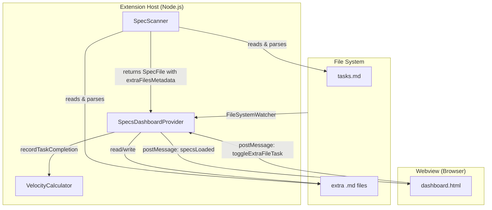

# Design Document: Additional Spec Files Support

## Overview

This feature extends the Kiro Specs Dashboard to treat extra markdown files in spec folders as first-class participants in task tracking. Currently, the scanner discovers extra `.md` files and the dashboard renders them in a dropdown for opening, but their content is opaque — checkbox items inside them are ignored for progress metrics.

The core change is: when an extra file contains markdown checkboxes (`- [ ]`, `- [x]`, `- [~]`, `- [-]`), classify it as a "task-like file" and include its task counts in the spec's aggregate metrics, display per-file progress in the UI, support toggling tasks from the dashboard, and feed completions into velocity tracking.

This is a vertical slice through the existing architecture — scanner, types, dashboard provider, webview, and velocity calculator — with no new modules required.

## Architecture

The feature follows the existing extension architecture and communication flow:



### Design Decisions

1. **Extend, don't replace**: The existing `extraFiles: string[]` field is kept for backward compatibility. A new `extraFilesMetadata` field carries the richer per-file data. Both are populated by the scanner.

2. **Reuse `parseTaskStats`**: The scanner already has a `parseTaskStats` method. Extra files use the same method, ensuring consistent checkbox parsing across all files.

3. **Aggregate at scan time**: Task counts from extra files are folded into the spec's `totalTasks`, `completedTasks`, `optionalTasks`, and `progress` during scanning, so downstream consumers (dashboard, velocity, analytics) automatically see the combined metrics without changes.

4. **New message type for extra file toggling**: A new `toggleExtraFileTask` webview message carries `specName`, `fileName`, and `taskLine`, keeping it distinct from the existing `toggleTask` (which always targets `tasks.md`).

5. **No new file watchers needed**: The existing `**/.kiro/specs/**/*.md` glob pattern already covers extra files. Changes to extra files trigger the same debounced refresh.

## Components and Interfaces

### SpecScanner Changes

The `parseSpecDirectory` method is extended to:
1. Read each extra `.md` file's content
2. Run `parseTaskStats` on it
3. Classify it as task-like if `totalTasks > 0`
4. Store per-file metadata in `ExtraFileMetadata[]`
5. Sum task-like file stats into the spec's aggregate metrics

```typescript
// New method
private async parseExtraFiles(
  specPath: vscode.Uri,
  extraFileNames: string[]
): Promise<ExtraFileMetadata[]> {
  const metadata: ExtraFileMetadata[] = [];
  for (const fileName of extraFileNames) {
    const fileUri = vscode.Uri.joinPath(specPath, fileName);
    const content = await this.readFile(fileUri);
    if (content === undefined) {
      // Log warning, push non-task metadata
      metadata.push({ fileName, isTaskLike: false });
      continue;
    }
    const stats = this.parseTaskStats(content);
    if (stats.totalTasks > 0) {
      metadata.push({
        fileName,
        isTaskLike: true,
        totalTasks: stats.totalTasks,
        completedTasks: stats.completedTasks,
        optionalTasks: stats.optionalTasks,
      });
    } else {
      metadata.push({ fileName, isTaskLike: false });
    }
  }
  return metadata;
}
```

### SpecsDashboardProvider Changes

1. **New message handler**: `toggleExtraFileTask` — reads the target extra file, toggles the checkbox on the specified line, writes it back, recalculates stats, and triggers a refresh.

2. **Velocity tracking**: `detectAndRecordTaskChanges` is extended to compare extra file task states between scans, recording completions the same way as `tasks.md` tasks.

### Webview (dashboard.html) Changes

The extra files dropdown section is updated:
- Task-like files show a progress badge (e.g., `3/5`) and a mini progress bar
- Non-task files render as before (markdown icon, click to open)
- Task-like files are expandable to show individual checkboxes that can be toggled inline

## Data Models

### New Type: ExtraFileMetadata

```typescript
/**
 * Metadata for an extra markdown file in a spec folder.
 * Task-like files have parsed task statistics.
 */
export interface ExtraFileMetadata {
  fileName: string;           // e.g., "test-cases.md"
  isTaskLike: boolean;        // true if file contains checkbox lines
  totalTasks?: number;        // only present if isTaskLike
  completedTasks?: number;    // only present if isTaskLike
  optionalTasks?: number;     // only present if isTaskLike
}
```

### SpecFile Interface Extension

```typescript
export interface SpecFile {
  // ... existing fields ...

  // Extra files (existing — kept for backward compatibility)
  extraFiles?: string[];

  // Extra files with parsed metadata (new)
  extraFilesMetadata?: ExtraFileMetadata[];
}
```

### New WebviewMessage Variant

```typescript
export type WebviewMessage =
  | // ... existing variants ...
  | { type: 'toggleExtraFileTask'; specName: string; fileName: string; taskLine: number };
```


## Correctness Properties

*A property is a characteristic or behavior that should hold true across all valid executions of a system — essentially, a formal statement about what the system should do. Properties serve as the bridge between human-readable specifications and machine-verifiable correctness guarantees.*

### Property 1: Parsing and classification correctness

*For any* markdown string, `parseTaskStats` SHALL return the correct count of total tasks, completed tasks, and optional tasks matching the checkbox patterns in the content. Furthermore, a file SHALL be classified as task-like if and only if its total task count is greater than zero.

**Validates: Requirements 1.1, 1.2, 1.3, 1.4**

### Property 2: Aggregation correctness

*For any* spec containing a `tasks.md` file and zero or more extra task-like files, the spec's `totalTasks` SHALL equal the sum of `totalTasks` from `tasks.md` and all extra task-like files. The same SHALL hold for `completedTasks` and `optionalTasks`. The spec's `progress` SHALL equal `round(completedTasks / totalTasks * 100)` when `totalTasks > 0`, and `0` when `totalTasks === 0`.

**Validates: Requirements 2.1, 2.2**

### Property 3: Dual-field consistency

*For any* spec with extra files, the `extraFiles` string array SHALL contain exactly the file names from `extraFilesMetadata`, in the same order. That is, `extraFiles[i] === extraFilesMetadata[i].fileName` for all valid indices.

**Validates: Requirements 3.2, 3.3**

### Property 4: Toggle preserves content integrity

*For any* markdown file content containing at least one checkbox line, toggling a checkbox at a valid line number SHALL flip exactly that checkbox's state (`[ ]` ↔ `[x]`) and leave all other lines unchanged.

**Validates: Requirements 5.2**

## Error Handling

| Scenario | Behavior | Requirement |
|---|---|---|
| Extra file cannot be read (permissions, deleted mid-scan) | Log warning, classify as non-task-like with `isTaskLike: false`, continue scanning | 1.5 |
| Toggle target file does not exist | Log error, send error message to webview, no crash | 5.3 |
| Toggle line number out of range | Log error, send error message to webview, no crash | 5.3 |
| Toggle line is not a checkbox | Log error, send error message to webview, no crash | 5.3 |
| Extra file content is empty or whitespace-only | Classify as non-task-like (`totalTasks === 0`), no error | 1.3 |
| Extra file has malformed markdown (no valid checkboxes) | Classify as non-task-like, no error | 1.3 |

All error handling follows the existing pattern: try-catch with detailed logging to the output channel, graceful degradation, and user-facing error messages only for interactive operations (toggle).

## Testing Strategy

### Property-Based Tests (fast-check)

The project already uses `fast-check` for property-based testing. Each property test runs a minimum of 100 iterations.

| Property | Test Description | Tag |
|---|---|---|
| Property 1 | Generate random markdown strings with mixed checkbox patterns, headings, and plain text. Verify `parseTaskStats` returns correct counts and `isTaskLike` classification matches `totalTasks > 0`. | `Feature: additional-spec-files-support, Property 1: Parsing and classification correctness` |
| Property 2 | Generate random task stats for `tasks.md` and N extra files (0–10). Verify aggregate `totalTasks`, `completedTasks`, `optionalTasks` equal the sums, and `progress` is correctly derived. | `Feature: additional-spec-files-support, Property 2: Aggregation correctness` |
| Property 3 | Generate random sets of extra file metadata. Verify `extraFiles` array and `extraFilesMetadata` array are consistent (same length, same file names, same order). | `Feature: additional-spec-files-support, Property 3: Dual-field consistency` |
| Property 4 | Generate random markdown with checkboxes, pick a random valid checkbox line, toggle it, verify only that line changed and the state flipped. | `Feature: additional-spec-files-support, Property 4: Toggle preserves content integrity` |

### Unit Tests (Jest)

- **Error handling**: File read failure during extra file parsing (mock `readFile` to throw)
- **Edge cases**: Spec with zero extra files, spec with only non-task extra files, spec with only task-like extra files
- **Toggle errors**: Non-existent file, out-of-range line, non-checkbox line
- **UI rendering**: Task-like files show progress badge, non-task files show plain icon (snapshot or assertion-based)

### Integration Tests

- **File watcher**: Modify an extra file on disk, verify dashboard refresh triggers and metrics update
- **Velocity tracking**: Toggle a task in an extra file, verify velocity event is recorded with correct `specName`
- **End-to-end scan**: Create a spec folder with `tasks.md` and extra files, scan, verify complete `SpecFile` output
