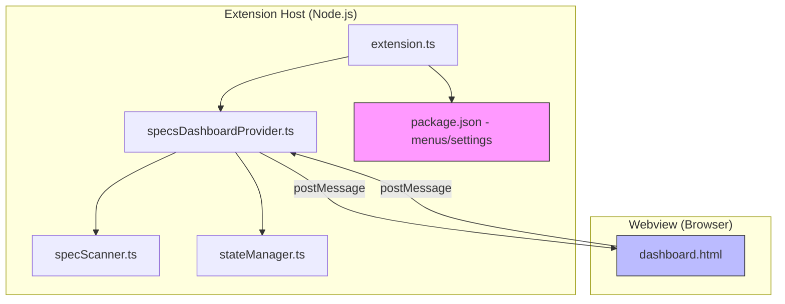

# Design Document: Dashboard Enhancements

## Overview

This design covers four enhancements to the Kiro Specs Dashboard VS Code extension:

1. **Workspace Folder Grouping** — Group spec cards under collapsible workspace folder headers in multi-root workspaces
2. **Configurable Extra File Labels** — Transform extra file names to human-readable labels with user-configurable overrides and visibility control
3. **Panel Refresh Button** — Add a refresh icon button to the webview view title bar
4. **Optional Task Progress Visualization** — Display two-segment progress bars distinguishing required vs optional task completion

All four enhancements operate within the existing extension architecture: the Extension Host (Node.js) handles data processing and state, while the Webview (browser) renders the UI. Communication flows through the established `postMessage` API.

## Architecture

The enhancements integrate into the existing layered architecture without introducing new modules. Each enhancement touches a specific vertical slice of the stack:



### Enhancement 1: Workspace Folder Grouping
- **specsDashboardProvider.ts**: Already sends `workspaceFolder` on each `SpecFile`. No backend changes needed.
- **dashboard.html**: The webview JavaScript groups specs by `workspaceFolder` when `>1` unique folders exist. Uses the existing `spec-group-header` CSS class and collapse behavior. Collapsed state stored in a session-scoped JS `Set`.

### Enhancement 2: Configurable Extra File Labels
- **package.json**: Register two new configuration properties under `kiroSpecsDashboard`: `extraFileLabels` (object map) and `extraFileVisibility` (object map).
- **extension.ts**: Listen for configuration changes to these settings and forward them to the provider/webview.
- **specsDashboardProvider.ts**: Read settings and include them in the `specsLoaded` message payload.
- **dashboard.html**: Apply label transformation and visibility filtering when rendering extra file rows. Default transformation: replace hyphens with spaces, capitalize each word.

### Enhancement 3: Panel Refresh Button
- **package.json**: Add a `view/title` menu contribution pointing the existing `specs-dashboard.refresh` command to the `navigation` group with the `$(refresh)` icon.
- No code changes needed — the command and handler already exist.

### Enhancement 4: Optional Task Progress Visualization
- **specScanner.ts**: Already parses optional task counts. The `SpecFile` type already carries `optionalTasks`. Need to also compute per-category completed counts (required completed vs optional completed).
- **types.ts**: Extend task stats interfaces to include `completedRequired` and `completedOptional` counts.
- **dashboard.html**: Render a two-segment progress bar (required segment + optional segment) and a textual breakdown below it.

## Components and Interfaces

### Modified Interfaces

#### `SpecFile` (types.ts) — Extended task stats

The existing `tasksFileStats` and `ExtraFileMetadata` interfaces need `completedRequired` and `completedOptional` fields to support the two-segment progress bar:

```typescript
// Extended in ExtraFileMetadata
export interface ExtraFileMetadata {
  fileName: string;
  isTaskLike: boolean;
  totalTasks?: number;
  completedTasks?: number;
  optionalTasks?: number;
  completedRequired?: number;   // NEW: completed non-optional tasks
  completedOptional?: number;   // NEW: completed optional tasks
}
```

The same fields are added to `SpecFile.tasksFileStats` and to the top-level `SpecFile` aggregated stats.

#### `specsLoaded` message payload — Extended with settings

```typescript
// Extended message payload
{
  type: 'specsLoaded';
  specs: SpecFile[];
  state: DashboardState;
  settings?: {                    // NEW
    extraFileLabels?: Record<string, string>;
    extraFileVisibility?: Record<string, boolean>;
  };
}
```

### New Configuration Properties (package.json)

```jsonc
{
  "kiroSpecsDashboard.extraFileLabels": {
    "type": "object",
    "default": {},
    "description": "Custom display labels for extra markdown files. Keys are file names without .md extension, values are display labels.",
    "additionalProperties": { "type": "string" }
  },
  "kiroSpecsDashboard.extraFileVisibility": {
    "type": "object",
    "default": {},
    "description": "Control visibility of extra markdown files. Keys are file names without .md extension, values are booleans.",
    "additionalProperties": { "type": "boolean" }
  }
}
```

### New Menu Contribution (package.json)

```jsonc
{
  "menus": {
    "view/title": [
      {
        "command": "specs-dashboard.refresh",
        "when": "view == specs-dashboard.view",
        "group": "navigation"
      }
    ]
  }
}
```

### Modified Components

#### `specScanner.ts` — `parseTaskStats()`

Extended to return `completedRequired` and `completedOptional` in addition to existing fields:

```typescript
parseTaskStats(content: string): {
  totalTasks: number;
  completedTasks: number;
  optionalTasks: number;
  completedRequired: number;   // NEW
  completedOptional: number;   // NEW
  progress: number;
}
```

Logic: For each matched task line, if `state === 'x'` and `isOptional`, increment `completedOptional`; if `state === 'x'` and `!isOptional`, increment `completedRequired`.

#### `specsDashboardProvider.ts` — `loadSpecs()`

After scanning, reads `kiroSpecsDashboard.extraFileLabels` and `kiroSpecsDashboard.extraFileVisibility` from configuration and includes them in the `specsLoaded` message. Also filters out hidden extra files from aggregated task counts when visibility is `false`.

#### `dashboard.html` — Rendering changes

1. **Workspace folder grouping**: Before rendering the spec list, group specs by `workspaceFolder`. If there are 2+ unique folders, render collapsible group headers using the existing `spec-group-header` class. Maintain folder order matching the order specs arrive (which mirrors VS Code's workspace folder order since `specScanner` iterates folders in order).

2. **Extra file labels**: When rendering extra file rows, apply the label transformation:
   ```javascript
   function getExtraFileLabel(fileName, settings) {
     const baseName = fileName.replace(/\.md$/, '');
     if (settings?.extraFileLabels?.[baseName]) {
       return settings.extraFileLabels[baseName];
     }
     // Default: hyphen-to-title-case
     return baseName.split('-').map(w => w.charAt(0).toUpperCase() + w.slice(1)).join(' ');
   }
   ```

3. **Extra file visibility**: Skip rendering extra files where `settings?.extraFileVisibility?.[baseName] === false`.

4. **Two-segment progress bar**: Replace the single `spec-progress-fill` div with two adjacent divs inside `spec-progress-bar`:
   ```html
   <div class="spec-progress-bar">
     <div class="spec-progress-fill required" style="width: ${requiredPct}%"></div>
     <div class="spec-progress-fill optional" style="width: ${optionalPct}%"></div>
   </div>
   ```
   The `.optional` segment uses a semi-transparent variant of the progress bar color.

5. **Textual breakdown**: Below the progress bar, show `"5/8 required · 2/3 optional"` when optional tasks exist.

## Data Models

### Task Stats (Extended)

```typescript
interface TaskStats {
  totalTasks: number;
  completedTasks: number;
  optionalTasks: number;
  completedRequired: number;
  completedOptional: number;
  progress: number;
}
```

Invariants:
- `completedTasks === completedRequired + completedOptional`
- `completedRequired <= (totalTasks - optionalTasks)`
- `completedOptional <= optionalTasks`
- `0 <= progress <= 100`

### Configuration Schema

```typescript
interface ExtraFileSettings {
  extraFileLabels: Record<string, string>;     // e.g., { "test-cases": "Test Cases" }
  extraFileVisibility: Record<string, boolean>; // e.g., { "test-cases": true }
}
```

### Webview Session State (in-memory)

```typescript
// Workspace folder collapse state (session-scoped, not persisted)
const collapsedWorkspaceFolders: Set<string> = new Set();
```


## Correctness Properties

*A property is a characteristic or behavior that should hold true across all valid executions of a system — essentially, a formal statement about what the system should do. Properties serve as the bridge between human-readable specifications and machine-verifiable correctness guarantees.*

### Property 1: Spec grouping by workspace folder is correct and order-preserving

*For any* array of `SpecFile` objects with varying `workspaceFolder` values, the grouping function SHALL produce groups where: (a) every spec in a group has the matching `workspaceFolder` value, (b) every input spec appears in exactly one group, (c) no specs are lost or duplicated, and (d) groups appear in the order of first occurrence of each `workspaceFolder` in the input array.

**Validates: Requirements 1.1, 1.6**

### Property 2: Extra file label resolution

*For any* file name string and any configuration map of custom labels, the label resolution function SHALL return the configured label when the file name (without `.md` extension) matches a key in the map, and SHALL return the hyphen-to-title-case transformation (hyphens replaced with spaces, each word capitalized) when no match exists. The default transformation SHALL never produce a string containing hyphens, and every word in the result SHALL start with an uppercase letter.

**Validates: Requirements 2.1, 2.2, 2.4**

### Property 3: Extra file visibility filtering

*For any* array of extra file metadata and any visibility configuration map, the visibility filter SHALL exclude exactly those files whose name (without `.md` extension) maps to `false` in the configuration. Files with no entry in the configuration SHALL be included (default visible). The aggregated task counts after filtering SHALL equal the sum of task counts from only the visible files.

**Validates: Requirements 2.7, 2.8**

### Property 4: Task stats decomposition invariant

*For any* valid task statistics produced by `parseTaskStats`, the following invariants SHALL hold: `completedTasks === completedRequired + completedOptional`, `completedRequired <= (totalTasks - optionalTasks)`, `completedOptional <= optionalTasks`, and `0 <= progress <= 100`.

**Validates: Requirements 4.3, 4.4**

### Property 5: Progress segment percentages are correct

*For any* valid task statistics where `totalTasks > 0`, the required progress percentage SHALL equal `Math.round((completedRequired / (totalTasks - optionalTasks)) * 100)` when there are required tasks, and the optional progress percentage SHALL equal `Math.round((completedOptional / totalTasks) * 100)`. The sum of both segment widths SHALL never exceed 100%.

**Validates: Requirements 4.3, 4.4**

### Property 6: Textual breakdown formatting

*For any* valid task statistics, the formatted breakdown string SHALL contain the exact completed and total counts for required tasks and, when optional tasks exist, the exact completed and total counts for optional tasks. The string SHALL match the pattern `"X/Y required"` or `"X/Y required · A/B optional"`.

**Validates: Requirements 4.7**

## Error Handling

### Configuration Errors
- **Invalid `extraFileLabels` values**: If a label value is not a string, ignore that entry and fall back to the default transformation. Log a warning to the output channel.
- **Invalid `extraFileVisibility` values**: If a visibility value is not a boolean, ignore that entry and default to visible. Log a warning.
- **Missing configuration**: Both settings default to empty objects `{}`, so all existing behavior is preserved when no configuration is provided.

### Grouping Errors
- **Missing `workspaceFolder`**: If a `SpecFile` has an undefined or empty `workspaceFolder`, assign it to a default group (e.g., `"Unknown"`). This prevents specs from being silently dropped.
- **Single workspace folder**: When only one unique folder exists, skip grouping entirely and render a flat list (no group headers).

### Progress Calculation Errors
- **Division by zero**: When `totalTasks === 0`, progress is `0%`. When `totalTasks - optionalTasks === 0` (all tasks are optional), required progress is `0%` and only the optional segment is shown.
- **Data inconsistency**: If `completedRequired + completedOptional !== completedTasks` due to a parsing bug, log a warning and use `completedTasks` as the source of truth for the overall progress bar.

### Webview Communication Errors
- **Settings not received**: If the webview receives a `specsLoaded` message without the `settings` field, fall back to default behavior (default label transformation, all files visible).

## Testing Strategy

### Unit Tests (Example-Based)

- **Grouping edge cases**: Single workspace folder (flat list), empty spec array, specs with undefined `workspaceFolder`
- **Label transformation edge cases**: Empty string, single word (no hyphens), multiple consecutive hyphens, already capitalized words
- **Visibility edge cases**: Empty visibility config, all files hidden, mixed visibility
- **Progress edge cases**: Zero total tasks, zero optional tasks, all tasks optional, all tasks completed
- **package.json validation**: Menu contribution exists with correct command, icon, and group; configuration properties have correct schema

### Property-Based Tests (fast-check)

Property-based tests use the `fast-check` library (already a project dependency) with a minimum of 100 iterations per property.

- **Property 1**: Generate random arrays of `{ name, workspaceFolder }` objects. Verify grouping correctness and order preservation.
  - Tag: `Feature: dashboard-enhancements, Property 1: Spec grouping by workspace folder is correct and order-preserving`
- **Property 2**: Generate random hyphenated file names and random config maps. Verify label resolution returns configured label or correct default transformation.
  - Tag: `Feature: dashboard-enhancements, Property 2: Extra file label resolution`
- **Property 3**: Generate random extra file arrays and visibility configs. Verify filtering correctness and aggregated task count consistency.
  - Tag: `Feature: dashboard-enhancements, Property 3: Extra file visibility filtering`
- **Property 4**: Generate random task content strings (with varying checkbox states and optional markers). Parse with `parseTaskStats` and verify decomposition invariants.
  - Tag: `Feature: dashboard-enhancements, Property 4: Task stats decomposition invariant`
- **Property 5**: Generate random valid task stats. Verify progress segment percentages match formulas and sum ≤ 100%.
  - Tag: `Feature: dashboard-enhancements, Property 5: Progress segment percentages are correct`
- **Property 6**: Generate random valid task stats. Verify the formatted breakdown string contains correct counts and matches the expected pattern.
  - Tag: `Feature: dashboard-enhancements, Property 6: Textual breakdown formatting`

### Integration Tests

- Verify that workspace folder change events trigger dashboard refresh
- Verify that configuration change events update labels and visibility without manual refresh
- Verify that task toggle updates both progress bar segments
- Verify that the refresh button menu contribution invokes the correct command
